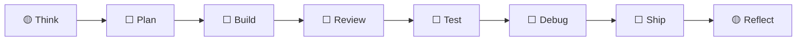

# MVP Project Status

**Project:** MVP Codex Router Kit

**Type:** generic

**Updated:** 2026-05-14T21:57:51.995Z

**Current Phase:** 🟡 Think

**Current Slice:** Define narrow MVP

**Overall Progress:** `██░░░░░░░░░░░░░░░░` 11%

**Estimated Total:** 24-59 hours

**Estimated Remaining:** 22-53 hours

## Visual Workflow



## Phase Status

| Phase | Status | Notes |
|---|---|---|
| 🟡 Think | in progress |  |
| ⬜ Plan | not started |  |
| ⬜ Build | not started |  |
| ⬜ Review | not started |  |
| ⬜ Test | not started |  |
| ⬜ Debug | not started |  |
| ⬜ Ship | not started |  |
| 🟡 Reflect | in progress |  |

## MVP Slices

| Slice | Phase | Status | Estimate | Blockers |
|---|---|---|---:|---|
| 🟡 Define narrow MVP ← current | Think | in progress | 1-3h |  |
| ⬜ Plan architecture and vertical slices | Plan | not started | 2-5h |  |
| ⬜ Build app shell | Build | not started | 3-6h |  |
| ⬜ Build core user flow | Build | not started | 6-14h |  |
| ⬜ Build persistence/logging | Build | not started | 3-8h |  |
| ⬜ Review MVP for bugs and scope creep | Review | not started | 2-5h |  |
| ⬜ Run QA and verification | Test | not started | 3-7h |  |
| ⬜ Prepare MVP handoff | Ship | not started | 1-3h |  |
| ⬜ Reflect and save resume state | Reflect | not started | 1-2h |  |
| ✅ MCP router health check and tracker safety fixes | Reflect | done | 2-6h |  |

## Next Actions

- Restart or reinstall the MCP router so patched init safety is active.
- Run a post-restart MCP smoke test for existing PROJECT_STATUS protection.
- Then initialize Quant-Agent tracker with a preserve-first migration.

## Risks / Guardrails

- Keep MVP scope narrow.
- Prefer boring, reliable code.
- Do not add major dependencies or paid services without approval.
- Running Codex MCP process may need restart/reinstall before patched source behavior is active in the live tool list.
- Quant-Agent has manual docs but no .mvp-router/project-state.json; do not initialize it with the old server because it would overwrite docs/PROJECT_STATUS.md.

## Resume Prompt

```text
Use $mvp-quality-router.
Read AGENTS.md, docs/CURRENT_STATE.md, docs/TODO.md, docs/DECISIONS.md, and docs/PROJECT_STATUS.md.
Project: MVP Codex Router Kit
Current phase: think.
Current slice: Define narrow MVP.
Call mvp-router get_project_status first, then continue only with the next safest step.
```
