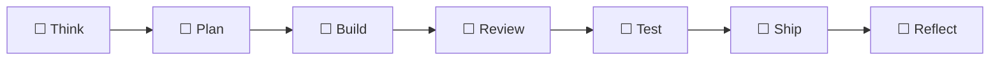

# MVP Project Status

This file is generated/updated by the MVP router tracker.

## Current Phase

TBD

## Current Slice

TBD

## Overall Progress

`░░░░░░░░░░░░░░░░░░` 0%

## Estimated Total

TBD hours

## Estimated Remaining

TBD hours

## Visual Workflow



## Resume Prompt

```text
Use $mvp-quality-router.
Call mvp-router get_project_status first.
Read AGENTS.md, docs/CURRENT_STATE.md, docs/TODO.md, docs/DECISIONS.md, and docs/PROJECT_STATUS.md.
Continue only with the next safest MVP step.
```
